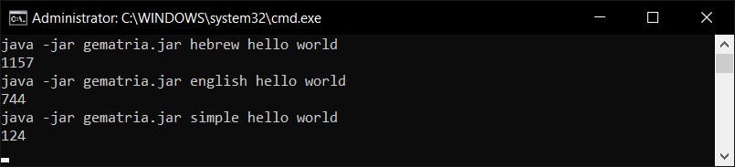

# Gematria
A Java Library for calculating the Gematria value of strings.



## 💡 Requirements
+ Java Runtime 1.8 **or higher**

## ⚙️ How To Add As Library
[Download the latest release](https://github.com/Konloch/Gematria/releases).

## 📚 Links
* [More Information On Gematria](https://en.wikipedia.org/wiki/Gematria)
* [Website](https://konloch.com/Gematria/)
* [Discord Server](https://discord.gg/aexsYpfMEf)
* [Download Releases](https://github.com/Konloch/Gematria/releases)

## 💻 Encoding Methods
	+ Hebrew
	+ English
	+ Simple

## 💻 How To Use (CLI)
**Select the Gematria encoding methods you wish to use, then calculate the hash with the following:**
```
java -jar gematria.jar hebrew Hello World
java -jar gematria.jar english Hello World
java -jar gematria.jar simple Hello World
```

## 💻 How To Use (API)
**Select the Gematria encoding methods you wish to use, then calculate the hash with the following:**
```java
long hash = Gematria.HEBREW.encode("Hello World");
hash = Gematria.ENGLISH.encode("Hello World");
hash = Gematria.SIMPLE.encode("Hello World");
```